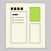

# Layout
Layout is a layout editor for HTML which outputs CSS.

## History
- v0.0.1 - The first virsion is created as a Word macro.  Layout should be edited with Word.
- v0.0.2 - Added Japanese version.

## Other Languages
- [日本語](README-ja.md)
